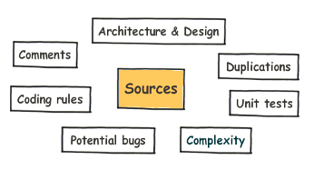
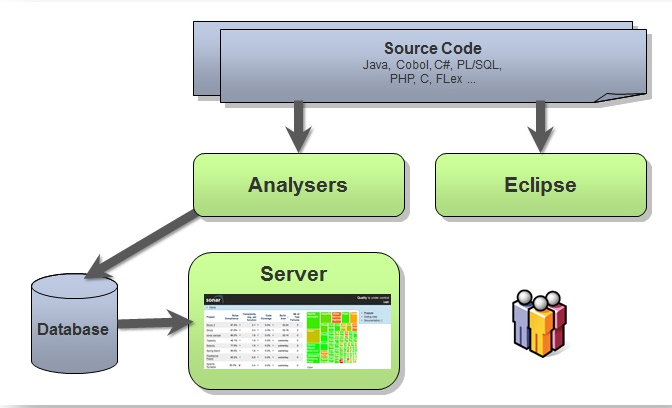

# SonarQube代码质量管理平台

## 简介
Sonar是一个用于代码质量管理的开源平台，用于管理Java源代码的质量。通过插件机制，Sonar 可以集成不同的测试工具，代码分析工具，以及持续集成工具，比如pmd-cpd、checkstyle、findbugs、Jenkins。通过不同的插件对这些结果进行再加工处理，通过量化的方式度量代码质量的变化，从而可以方便地对不同规模和种类的工程进行代码质量管理。同时 Sonar 还对大量的持续集成工具提供了接口支持，可以很方便地在持续集成中使用 Sonar。 此外，Sonar 的插件还可以对 Java 以外的其他编程语言提供支持，对国际化以及报告文档化也有良好的支持。

## 目录
[工作原理介绍](#a1)

[ubuntu安装](#a2)

[android sonar 检测配置](#a3)

[ios sonar 检测配置](#a4)

[sonar-project.properties参数介绍](#a5)

<a name="a1"></a>

### 工作原理

SonarQube 并不是简单地将各种质量检测工具的结果（例如 FindBugs，PMD 等）直接展现给客户，而是通过不同的插件算法来对这些结果进行再加工，最终以量化的方式来衡量代码质量，从而方便地对不同规模和种类的工程进行相应的代码质量管理。
SonarQube 在进行代码质量管理时，会从图 1 所示的七个纬度来分析项目的质量。

***图1***



SonarQube 可以支持 25+ 种编程语言，针对不同的编程语言其所提供的分析方式也有所不同：
对于所有支持的编程语言，SonarQube 都提供源了代码的静态分析功能；
对于某些特定的编程语言，SonarQube 提供了对编译后代码的静态分析功能，比如 java 中的 class file 和 jar 和 C# 中的 dll file 等；
对于某些特定的编程语言，SonarQube 还可以提供对于代码的动态分析功能，比如 java 和 C# 中的单元测试的执行等。

SonarQube 平台的整体架构如图 2 所示:

***图2***



远程客户机可以通过各种不同的分析机制，从而将被分析的项目代码上传到 SonarQube server 并进行代码质量的管理和分析，SonarQube 还会通过 Web API 将分析的结果以可视化、可度量的方式展示给用户。

<a name="a2"></a>

### ubuntu安装

##### 1、 安装jdk，DBMS(打包机用了mysql)

##### 2、 创建sonar user 和 database
```sh
mysql -u root -p
CREATE DATABASE sonar CHARACTER SET utf8 COLLATE utf8_general_ci;
CREATE USER 'sonar' IDENTIFIED BY 'sonar';
GRANT ALL ON sonar.* TO 'sonar'@'%' IDENTIFIED BY 'sonar';
GRANT ALL ON sonar.* TO 'sonar'@'localhost' IDENTIFIED BY 'sonar';
FLUSH PRIVILEGES;

```

##### 3、下载sonar zip

[最新版本](http://www.sonarqube.org/downloads/)

```sh
wget http://dist.sonar.codehaus.org/sonarqube-5.1.zip
unzip sonarqube-5.1.zip
mv sonarqube-5.1 /usr/local

```

##### 4、 修改sonar.properties

路径 /usr/local/sonar/conf/sonar.properties

```sh
sonar.jdbc.username=sonar
sonar.jdbc.password=sonar
sonar.jdbc.url=jdbc:mysql://localhost:3306/sonar?useUnicode=true&characterEncoding=utf8&rewriteBatchedStatements=true&useConfigs=maxPerformance
```

##### 5、 启动sonar
```sh
sudo /usr/local/sonar/bin/linux-x86-64/sonar.sh start
```

##### 6、访问 http://localhost:9000

<a name="a3"></a>
### android sonar 检测配置

***build.gradle***

```groovy
apply plugin: "sonar-runner"
```

***配置sonar 参数***

```groovy
sonarRunner {
    toolVersion = "2.4"
    sonarProperties {
        property "sonar.projectBaseDir", "${project.rootDir}/${project.name}/"
        property "sonar.host.url", "http://****:9000"  
        property "sonar.jdbc.url", "jdbc:mysql://****/sonar"
        property "sonar.jdbc.driverClassName", "com.mysql.jdbc.Driver"
        property "sonar.jdbc.username", "***"
        property "sonar.jdbc.password", "***"
        property "sonar.login", "***"
        property "sonar.password", "***"
        property "sonar.exclusions", "**/exclude/**"
        property "sonar.sources", "${project.rootDir}/${project.name}/src/main/java"
        property "sonar.binaries", "$project.buildDir/intermediates/classes/"
        property "sonar.projectKey", "sdk:${project.name}"
        property "sonar.projectName", project.name
        property "sonar.projectVersion", "1.0.0"
        property "sonar.projectDescription", project.name
    }
}
```

***运行task***

```sh
gradle sonarRunner
```

<a name="a4"></a>
### ios sonar 检测配置

条件

1. [xctool](https://github.com/facebook/xctool)

2. [OCLint](http://docs.oclint.org/en/dev/intro/installation.html)

3. [gcovr](https://github.com/gcovr/gcovr/releases)

***配置文件***

把run-sonar.sh放置工程目录下
[sonar-project.properties](sonar-project.properties)

***执行脚本***

把run-sonar.sh放置工程目录下
[run-sonar.sh](run-sonar.sh)


<a name="a5"></a>
### sonar-project.properties参数介绍

| properties        | Default value  |
| ------------- |-----|
|sonar.host.url|[http://localhost:9000](http://localhost:9000)|
|sonar.jdbc.url|sonar|
|sonar.jdbc.username|sonar|
|sonar.jdbc.password|sonar|
|sonar.projectKey	|
|sonar.projectName	|
|sonar.language|java|
|sonar.sources|
|sonar.projectDescription	|
|sonar.binaries|
|sonar.tests|
|sonar.sourceEncoding|
|sonar.importSources|
|sonar.exclusions|
|sonar.skippedModules|
|sonar.includedModules|
|sonar.branch|
|sonar.profile|
|sonar.skipDesign|
|sonar.phase|
|sonar.working.directory|


